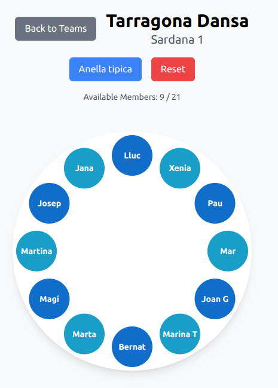

# Sardanes Anelles Creator

A web application designed to simplify the creation of **anelles** for **sardanes**, a traditional Catalan dance. This tool helps users easily create, arrange, and manage anelles, enhancing the organization and visualization of dance formations. This app was specifically made for Tarragona Dansa agrupation.

## Project Overview

The **Sardanes Anelles Creator** aims to streamline the process of creating *anelles* by allowing users to interactively select participants, organize them into circles, and visualize the final formation. This app can be especially useful for dance organizers, instructors, and participants to prepare before an event.

## Features

- **Responsive Circle Creation**: Generate a primary circle surrounded by smaller circles representing participants.
- **Customizable Circle Arrangement**: Click on any participant circle to modify its placement or details.
- **Dynamic Positioning**: Ensures responsive design so that all elements remain visible, regardless of screen size.
- **Participant Selection**: Easily assign participants to circles using a popup with options.
- **Real-time Preview**: View the formation as you make changes.

## Demo

Test the demo in: [demo](https://joangoma.github.io/creador-anelles/)
